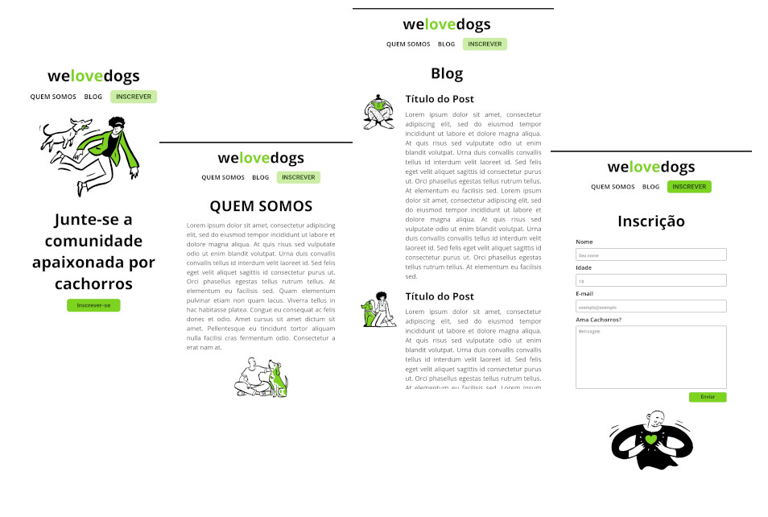

# Atividade de Núcleo

## Informações principais

- **Núcleo:** Web
- **Orientadores:** [Lávio Vale](https://gitlab.com/lavio), [Victor Hugo](https://gitlab.com/victorhsmsantos) e [Luiz Valverde](https://gitlab.com/luiz2003)

## Descrição da atividade

O projeto WeLoveDogs tem por objetivo iniciar o aprendizado em HTML e CSS, 2 das 3 tecnnologias bases do front-end. O projeto possui o formato static multipage¹, com 4 páginas no total e a maneira de navegar e visualizar seu conteúdo por completo é através dos links do menu.

## Tarefas

- Desenvolver as telas com base mockup do figma utilizando HTML e CSS

## Objetivos

- Desenvolver habilidades utilizando o CSS
  - Seletores
  - Regras basicas
  - Estilização de formularios
  - Links para outros arquivos HTML
  - Espaçamento e organização de layout com flexbox
  - Utilização de fonts externas (Google Fonts)
- Desenvolver habilidades utilizando o HTML
  - Tags básicas
  - Tags de formulario
  - Tags Semanticas
  - Importar imagens
  - Organização de layout
  - Importar fontes externas e arquivos css

## Milha extra :rocket:

- Medidas relativas para fontes, espaçamentos e dimensões
- Media querys para responsividade
- Efeitos hover para melhorar a UI

# Resultados :smile

## Screenshots Desktop

## Screenshots Mobile

