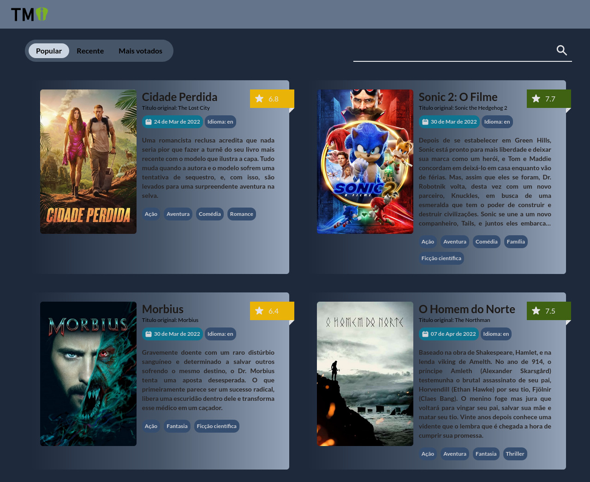

# Atividade de Núcleo

## Informações principais

- **Núcleo:** Web
- **Orientadores:** [Lávio Vale](https://gitlab.com/lavio), [Victor Hugo](https://gitlab.com/victorhsmsantos) e [Luiz Valverde](https://gitlab.com/luiz2003)

## Descrição da atividade

O projeto MovieDB tem por objetivo explorar a API¹ do site [TheMovieDB](https://www.themoviedb.org/) e aprender como configurar a comunicação entre front-end e back-end em um mesmo projeto. O lado server-side será responsável por habilitar o servidor, puxar as informações da API do TheMovieDB e disponibilizar para ser utilizado pelo front. O lado client-side será responsável por obter os dados do servidor local e estruturar a página de forma que transforme os dados obtidos em um sites de filmes.

## Tarefas

- Criar um api com node e express para consumir a api do TMDB e expor os dados dos filmes
- Consumir os dados da sua api e exibir os filmes com HTML, CSS e JavaScript
- Criar a responsividade do site de forma que ele não quebre em resoluções de 375px+

## Objetivos

- Desenvolver habilidades de desenvolver apis
  - Node e Express
  - Conceitos de rotas e REST
  - HTTP Status Code
- Desenvolver habilidades de consumir apis
  - Usar libs JavaScript para consumir apis como Axios
  - Tratar na exibição diferentes retornos da api, como erro ou falta de dados

## Milha extra :rocket:

- ReactJs para o front-end
- Testes Unitarios nas rotas com jest
- Conceito de Inversão de dependencias na api
- Paginação e ordenação dos dados da rota
- Rota de pesquisa de filmes
- Rota de generos de filmes
- Loading infinito no front-end para exibir mais filmes no scroll
- Tab buttons para ordenação dos filmes
- Barra de pesquisar filmes

# Resultados :smile:

## Screenshots Desktop

## Screenshots Mobile

