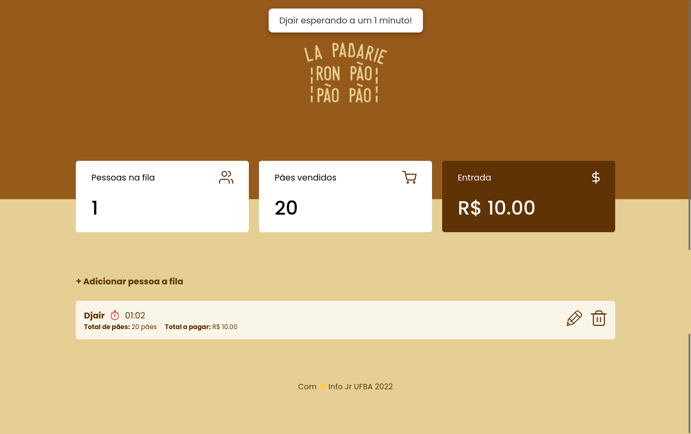
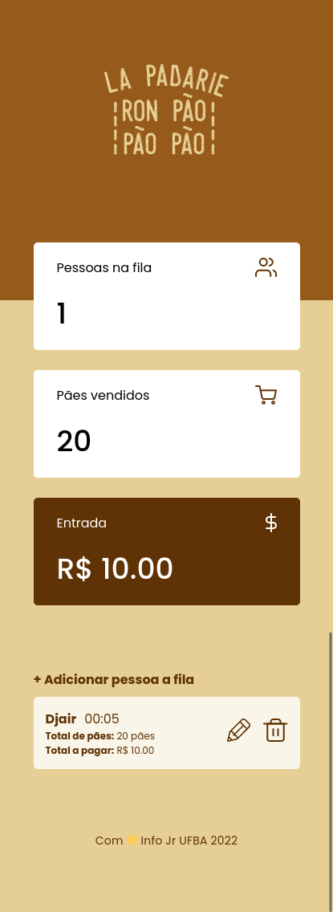

# Atividade de Núcleo

## Informações principais

- **Núcleo:** Web
- **Orientadores:** [Lávio Vale](https://gitlab.com/lavio), [Victor Hugo](https://gitlab.com/victorhsmsantos) e [Luiz Valverde](https://gitlab.com/luiz2003)

## Descrição da atividade

O projeto La Padarie tem por objetivo continuar o aprendizado em HTML, CSS e Javascript, simulando um mini sistema de vendas de pães. O projeto possui o formato single page, em que todas as ações acontecem na mesma página, sem o auxílio e carregamento de links de navegação.

## Tarefas

- Desenvolver as telas com base mockup do figma utilizando HTML e CSS
- Criar a responsividade do site de forma que ele não quebre em resoluções de 375px+
- Criar as funcionalidades do site utilizando JavaScript
  - Adicionar pedido
  - Excluir pedido

## Objetivos

- Desenvolver habilidades de manipulação da dom com base em dados utilizando JavaScript

## Milha extra :rocket:

- ReactJs para o front-end
- Mensagens para melhorar experiencia do usuario com toasts
- Funcionalidade de editar pedido
- Timer do pedido com aviso de tempo esperado depois de 1 minuto

# Resultados :smile:

## Screenshots Desktop

## Screenshots Mobile

