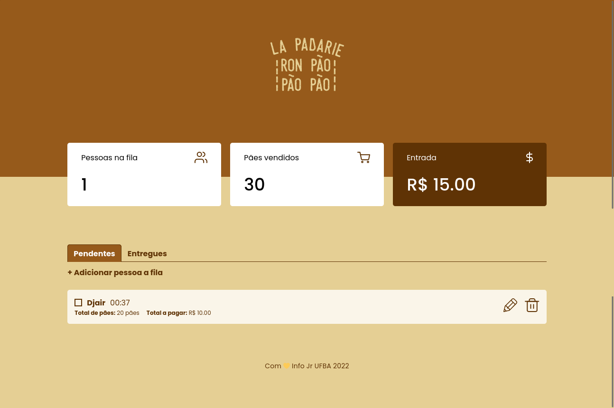
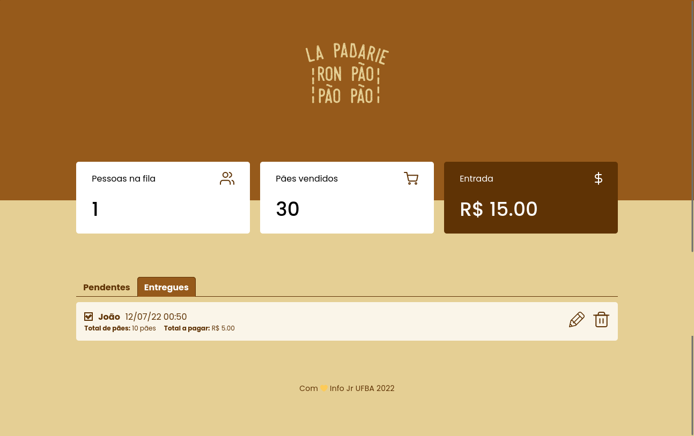
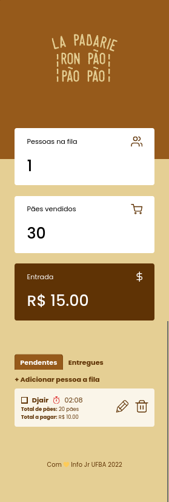
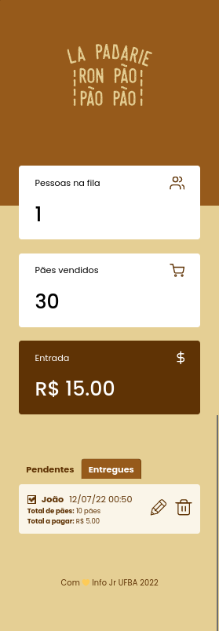

# Atividade de Núcleo

## Informações principais

- **Núcleo:** Web
- **Orientadores:** [Lávio Vale](https://gitlab.com/lavio), [Victor Hugo](https://gitlab.com/victorhsmsantos) e [Luiz Valverde](https://gitlab.com/luiz2003)

## Descrição da atividade

Crie uma tabela sql com colunas referentes a informações de cada pedido (id, nome do cliente e quantidade de pães) e, usando o express js, crie uma api que se comunique com o banco de dados e possa adicionar e acessar os pedidos.
Copie o front-end da atividade passada para esta pasta e integre o seu back-end com o front-end fazendo requisições a sua api.

## Tarefas

- Criar uma tabela sql para armazenar os pedidos
- Desenvolver a api que insere e lê os dados da tabela
- Atualizar o projeto lapadarie da ultima atividade para se comunicar com a nova api

## Objetivos

- Desenvolver habilidades de utilização de banco de dados

## Milha extra :rocket:

- NestJs e Prisma para o backend
- Funcionalidade de marcar se o pedido foi entregue
- Testes unitarios no backend

# Resultados :smile:

## Screenshots Desktop

## Screenshots Mobile

