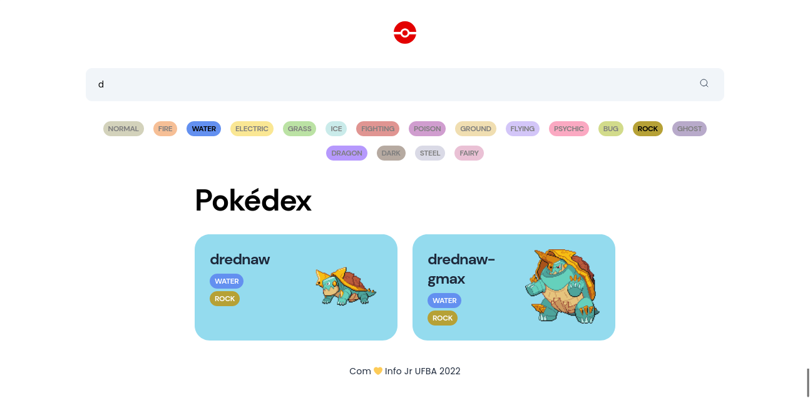
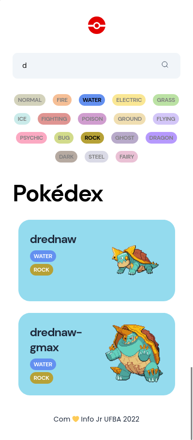

# Atividade de Núcleo

## Informações principais

- **Núcleo:** Web
- **Orientadores:** [Lávio Vale](https://gitlab.com/lavio), [Victor Hugo](https://gitlab.com/victorhsmsantos) e [Luiz Valverde](https://gitlab.com/luiz2003)

## Descrição da atividade

O projeto Pokedex tem por objetivo iniciar o aprendizado em React. O projeto tem formato de uma página dinâmica e responsiva.

## Tarefas

- Desenvolver as telas com base mockup do figma utilizando HTML e CSS
- Utilizar ReactJs para desenvolver as telas/funcionalidades
- Consumir os dados da pokeapi
- Criar um filtro pelo tipo do pokemon

## Objetivos

- Desenvolver habilidades de utilização do framework ReactJs

## Milha extra :rocket:

- Filtro pelo nome do pokemon
- ScrollInfinito buscando mais pokemons
- Filtro de tipo combinado (mais de um tipo ao mesmo tempo)

# Resultados :smile:

## Screenshots Desktop

## Screenshots Mobile

